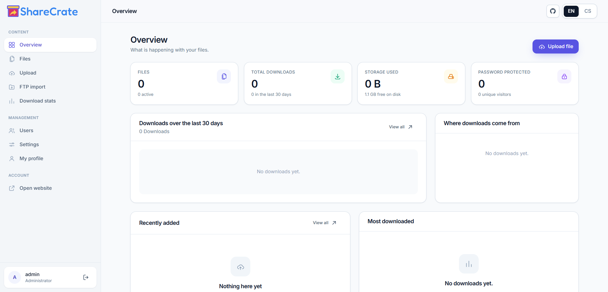

<p align="center">
  
</p>

<h1 align="center">ShareCrate</h1>

<p align="center">
  
  
  
  
  <br>
  
  
</p>

<p align="center">
  <b>Private file sharing</b><br>
  <i>Short, single-purpose links with optional password, expiry and download limits.</i>
</p>

<p align="center">
  
  
  
  
</p>

<p align="center">
  ⭐ Enjoying ShareCrate? Give it a Star and Fork the repository! ❤️<br>
  Your support helps me see that the project is useful to developers<br>
  and motivates me to keep improving it with more frequent updates.
</p>

<p align="center">
  <a href="https://github.com/neikiri/sharecrate/fork">
    
  </a>
</p>

---

<p align="center">
  
</p>

---

Private file sharing. Upload files over FTP or straight from the browser, get a short
link, and that link only works for whoever you send it to. Optionally password protected,
with an expiry date, a download limit, and a log of who downloaded what and when.

Stack: **PHP 8.1+ / MySQL** on the backend, **Tailwind CSS 4 + Alpine.js** on the frontend.
Node.js is only needed for the build — the result is plain PHP + static assets for Apache.

---

## 🧭 Overview

ShareCrate turns a plain Apache + MySQL box into a private file-drop: you upload a file
(from the browser or over FTP), it gets a short link built from the file name, and that
link is the only way to reach the file — there is no public listing, no directory browsing,
and search engines are told to stay out.

```
example.com/annual-report-2026.pdf
```

That link can be handed out as-is, or locked down further with a password, an expiry date,
and a maximum number of downloads. Every download is logged — time, country, browser,
platform — and the whole thing is managed from a small admin dashboard.

Under the hood it is a front-controller PHP app (no framework) with a MySQL database, built
with Tailwind CSS and Alpine.js on the frontend. The build step only touches assets — what
ends up in `dist/` is plain PHP and static files ready for any shared or VPS Apache host.

---

## 🤔 Why ShareCrate?

- **No public listing, ever.** Files are only reachable by their exact link. `robots.txt`
  disallows indexing and every page ships `noindex`, so nothing about your files ends up
  in a search engine.
- **Files stay outside the webserver's reach.** Uploads live in a directory Apache is
  blocked from serving directly; everything goes through PHP, which supports Range requests
  so downloads can pause and resume.
- **Real access control, not just an obscure URL.** Add a password, an expiry date, and/or
  a maximum download count per file — independently, and changeable at any time without
  touching the underlying file.
- **Two ways in.** Drag files into the browser for a quick share, or drop them onto an FTP
  account and turn them into links from the dashboard (or automatically via cron).
- **A build step you can forget about.** Node.js is only needed to produce `dist/` — the
  result is framework-free PHP and hashed static assets, so deploying is just copying files
  to Apache.
- **Bilingual by default.** Visitors from Czechia or Slovakia get the Czech UI automatically,
  everyone else gets English, and the choice is remembered per visitor and per account.

If you want a small, self-hosted way to hand someone a file without exposing everything
else on the server, that is the gap ShareCrate fills.

---

## ✨ Features

**Links**
- The address carries the file name: `example.com/annual-report-2026.pdf`
- Custom alias, rewritable at any time
- Configurable shape for new aliases: from the file name / name + random suffix / random only
- No public listing anywhere, `robots.txt` disallows indexing, pages are `noindex`

**Protection**
- Password on individual files (bcrypt/argon2, brute-force throttling)
- Link expiry date and a maximum download count
- Disable a link without deleting the file
- Files live outside the webserver's reach and are served by PHP (Range requests, resumable downloads)

**Dashboard**
- Overview: downloads over 30 days, storage used, most downloaded files, recent activity
- File management: search, filters, bulk actions, detail page with download history
- Per download: time, IP (per privacy setting), country, city, browser, platform
- CSV export of the log
- Users: *administrator* / *uploader* roles, storage quotas, account activation
- Settings: site name, timezone, alias shape, log retention, upload limits

**Uploading**
- Drag & drop in the browser with per file progress
- FTP: drop files with an FTP client into `storage/uploads/`, then turn them into links with
  one click in *FTP import* (or automatically via cron with `bin/scan.php --import`)

**Languages**
- Czech and English, a CZ/EN switch in the header
- Visitors from Czechia or Slovakia get Czech, everyone else gets English
- The choice is remembered in a cookie, and on the account for signed in users

---

## 🚀 Getting started

1. **Clone the repository** and install the build dependencies.
   ```bash
   git clone https://github.com/neikiri/sharecrate.git
   cd sharecrate
   npm install
   ```
2. **Build the app.** This compiles the Tailwind/Alpine.js assets and assembles `dist/`.
   ```bash
   npm run build
   ```
3. **Upload the contents of `dist/`** to your Apache document root — see the
   "📦 Deploying to Apache" section below for the full checklist (permissions,
   database, `mod_rewrite`).
4. **Open `/install`** on your domain and go through the setup wizard: database details,
   site address, first administrator account. It writes `.env` for you and locks itself
   once done.

That's it — sign in at `/admin` and start uploading. See "📋 Requirements" below for
the PHP/MySQL/Apache versions you'll need, and "⚙️ Configuration (`.env`)" for everything
that can be tuned afterwards.

---

## 🛠️ Build

```bash
npm install
npm run build
```

The result lands in `dist/` and is the document root as-is — **no `public/` folder**:

```
dist/
├── .htaccess          rewrite rules, hardening, cache headers
├── index.php          front controller
├── admin/             dashboard entry (index.php)
├── assets/            app-[hash].css, app-[hash].js, fonts, favicon, manifest.json
├── app/               application code (Apache is blocked from serving it directly)
│   ├── Controllers/  Core/  Models/  Support/  Views/  locales/
├── bin/               scan.php, cleanup.php for cron
├── database/          schema.sql used by the installer
└── storage/           upload / FTP target (Apache is blocked from serving it directly)
```

Other scripts:

```bash
npm run build:assets   # Tailwind/JS only, via Vite
npm run dev             # vite build --watch while editing CSS/JS
npm run lint:php        # php -l over every PHP file
npm run serve           # local preview of dist/ via the PHP dev server (port 8080)
```

`npm run serve` uses `build/router.php`, which mirrors the `.htaccess` rules, so the
local preview behaves the same way production does.

---

## 📦 Deploying to Apache

1. **Upload the contents of `dist/`** into the document root (e.g. `/var/www/example.com` or
   `public_html`). Upload the *contents* of `dist/`, not the folder itself.
2. **Permissions:** `storage/` must be writable by the webserver, and the site root must be
   writable during installation (so the installer can create `.env`).
   ```bash
   chown -R www-data:www-data storage
   chmod -R 775 storage
   ```
3. **Create an empty MySQL database** with `utf8mb4` and a user with rights on it.
4. **Open `https://example.com/install`** and go through the installer: database
   details → site address → first administrator. The installer creates the tables, the
   account and the `.env` file, then locks itself.
5. **Check Apache config:** you need `mod_rewrite` and `AllowOverride All` for the
   directory, otherwise `.htaccess` has no effect and `storage/` would be publicly reachable.
   ```apache
   <Directory /var/www/example.com>
       AllowOverride All
       Require all granted
   </Directory>
   ```
6. **HTTPS:** a redirect-to-HTTPS block is ready in `.htaccess`, just uncomment the three lines.

### Updating

Upload the contents of `dist/` again, overwriting the old files. The build never contains
`.env`, and `storage/uploads/` only contains a `.gitkeep`, so neither the configuration nor
uploaded files get overwritten. Asset filenames change hash on every build, so nothing is
served from a stale cache by mistake.

---

## 📁 FTP workflow

1. Point an FTP account at `storage/uploads/` (subfolders are fine too, they are scanned recursively).
2. Upload files.
3. In the dashboard, **FTP import** → select → *Publish selected*. The alias is derived from the file name.

Incomplete uploads are ignored: files with extensions like `.filepart`, `.part`,
`.crdownload`, `.tmp`, and files modified in the last 5 seconds are not offered for import.

Automatic import via cron:

```cron
*/10 * * * * /usr/bin/php /var/www/example.com/bin/scan.php --import >/dev/null 2>&1
20 3 * * *   /usr/bin/php /var/www/example.com/bin/cleanup.php >/dev/null 2>&1
```

`cleanup.php` prunes old logs according to the retention setting, expired login tokens and
orphaned thumbnails. Without cron, the same cleanup runs occasionally on a normal request.

---

## ⚙️ Configuration (`.env`)

The installer writes this file for you; here is what can be tuned afterwards:

| Key | Description |
|---|---|
| `APP_URL` | Full site address, used to build share links |
| `APP_BASE_PATH` | Only fill in when the site runs in a subdirectory (`/dl`) |
| `APP_KEY` | 64 hex characters, used to sign tokens and hash IP addresses |
| `APP_DEBUG` | `true` prints errors to the page — keep `false` in production |
| `DB_*` | MySQL connection details |
| `STORAGE_PATH` | Upload target, relative to the site root (`storage/uploads`) |
| `DEFAULT_LOCALE` | Language for visitors outside `CZECH_COUNTRIES` |
| `CZECH_COUNTRIES` | Countries that get the Czech version (`CZ,SK`) |
| `GEOIP_PROVIDER` | `auto` / `cloudflare` / `server` / `api` / `none` |
| `TRUSTED_PROXIES` | IPs of reverse proxies allowed to set `X-Forwarded-For`, or `*` |

### Country detection

Order: infrastructure headers (`CF-IPCountry`, `GEOIP_COUNTRY_CODE`) → database cache →
a lookup against `ip-api.com` (cached for 30 days). If none of that resolves, `Accept-Language`
decides, then `DEFAULT_LOCALE`.

Behind Cloudflare, set `TRUSTED_PROXIES=*` (or specific ranges) — `CF-Connecting-IP` and
`CF-IPCountry` are then used and no external call is needed. To run without any external
API, set `GEOIP_PROVIDER=server`, or `none` to switch detection off entirely.

---

## 📋 Requirements

- PHP 8.1+ with `pdo_mysql`, `mbstring` (recommended: `fileinfo`, `gd` for thumbnails,
  `intl` for country names, `curl` for geolocation)
- MySQL 5.7+ / MariaDB 10.3+
- Apache with `mod_rewrite` (ideally also `mod_headers`, `mod_deflate`)
- Node.js 20.19+ **for the build only**

Browser upload limits follow `upload_max_filesize` and `post_max_size` (`.htaccess` sets
512 MB for mod_php; for PHP-FPM this belongs in `.user.ini` or the pool configuration).
The current effective limit is shown right on the upload page. Use FTP for anything bigger.

---

## 🔒 Security

- Passwords via `password_hash()`, throttling on both login and file password attempts
- CSRF token on every POST form
- Sessions: `HttpOnly`, `SameSite=Lax`, `Secure` over HTTPS, ID rotation on login
- Prepared statements everywhere, whitelisted identifiers for dynamic queries
- `app/` and `storage/` blocked via `.htaccess`, uploads are always served through PHP
- HTML, SVG, JS and PHP are never served inline, always as an `attachment`
- CSP, `X-Content-Type-Options`, `Referrer-Policy`, `X-Frame-Options`
- Path traversal guarded on every `storage/` path
- Privacy: IPs can be stored in full, truncated (`192.168.1.0`), or not at all — unique
  visitor counts still work either way, computed from a salted hash

---

## 🗂️ Repository layout

```
src/
├── frontend/
│   ├── app.css        Tailwind theme + components (btn, card, table, …)
│   ├── app.js         Alpine components (upload, copy, confirm, toasts)
│   └── static/        favicon
└── server/            → copied into dist/
    ├── .htaccess  index.php  admin/  bin/  storage/
    └── app/
        ├── Core/         Kernel, Router, Request/Response, Auth, I18n, Geo, View, …
        ├── Controllers/  public side, /admin, installer
        ├── Models/       FileItem, Download, User, Setting, ActivityLog
        ├── Support/      Storage, Scanner, Alias, Downloader, Thumbnailer, FileTypes
        ├── Views/        layouts, partials, public, admin, install
        └── locales/      cs.php, en.php
build/                  build.mjs, serve.mjs, router.php, lint-php.mjs
database/schema.sql
```

### Adding a language

Copy `src/server/app/locales/en.php`, translate it, and add the code to `I18n::AVAILABLE`
and `I18n::localeNames()`. The switcher and the detection logic pick it up automatically.

---

## 📄 License

Released under the **MIT License**. See the [LICENSE](LICENSE) file for details.
